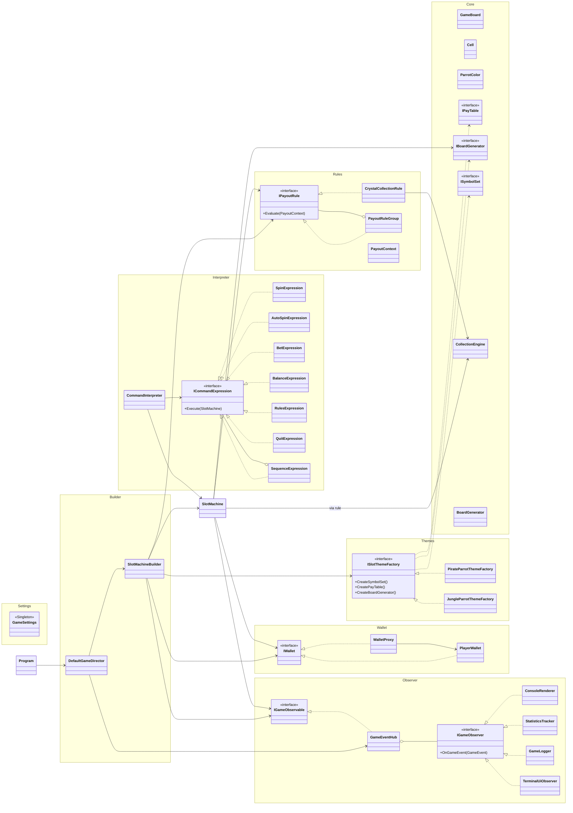

# Pirate Parrots Slots — Docs

Документация по архитектуре и паттернам проекта.

## Файлы

| Файл | Назначение |
|------|------------|
| [pattern-map.md](pattern-map.md) | Краткая карта паттернов и ключевых классов |
| [patterns.md](patterns.md) | Подробное описание применения паттернов |
| [uml.puml](uml.puml) | PlantUML-версия диаграммы |

## Паттерны

| Паттерн | Основные классы |
|---------|-----------------|
| Abstract Factory | `ISlotThemeFactory`, `PirateParrotThemeFactory`, `JungleParrotThemeFactory` |
| Singleton | `GameSettings` |
| Builder | `SlotMachineBuilder`, `DefaultGameDirector` |
| Composite | `IPayoutRule`, `CrystalCollectionRule`, `PayoutRuleGroup` |
| Proxy | `IWallet`, `PlayerWallet`, `WalletProxy` |
| Interpreter | `CommandInterpreter`, `ICommandExpression`, `*Expression` |
| Observer | `IGameObservable`, `IGameObserver`, `GameEventHub`, observers |

## Mermaid Diagram

